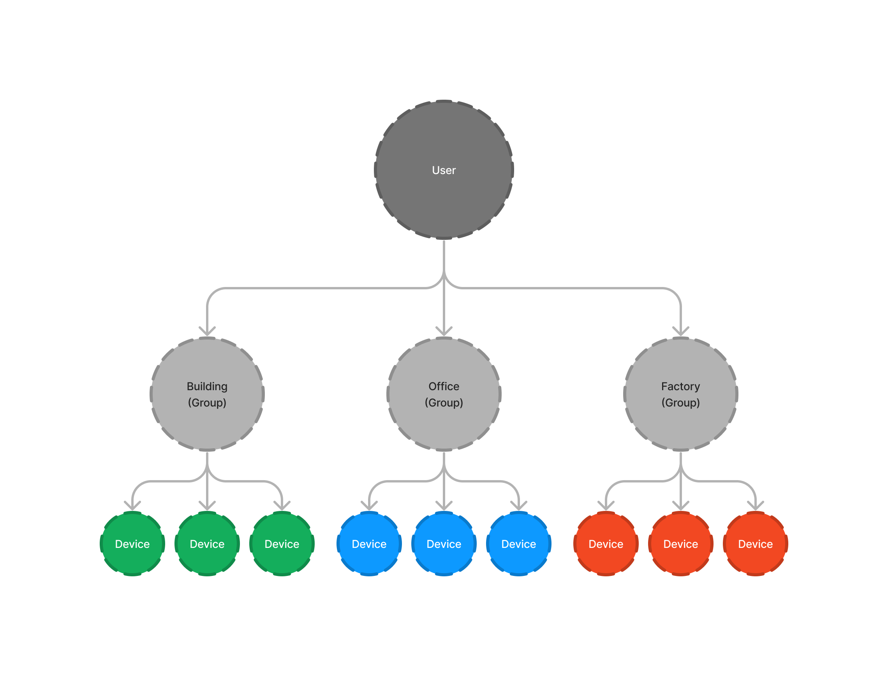
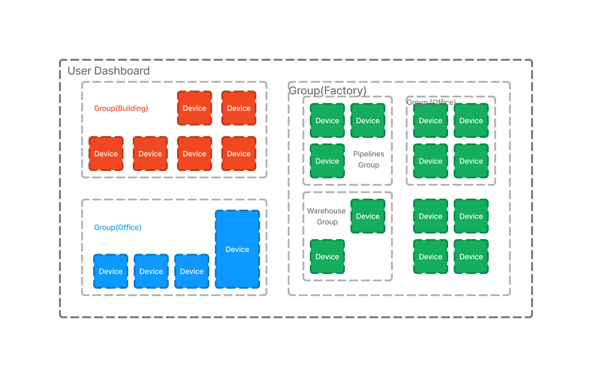
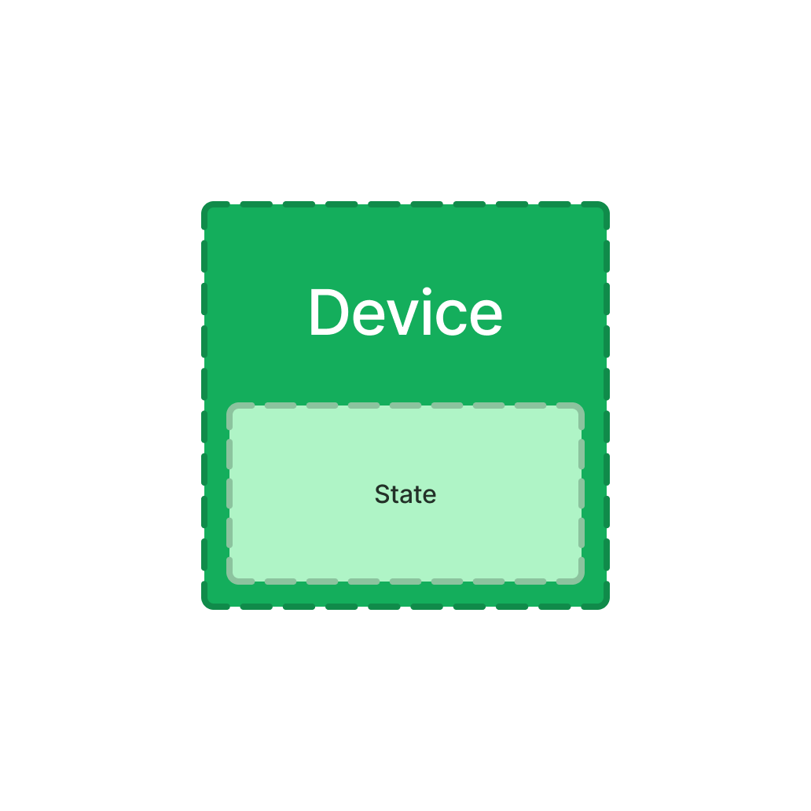
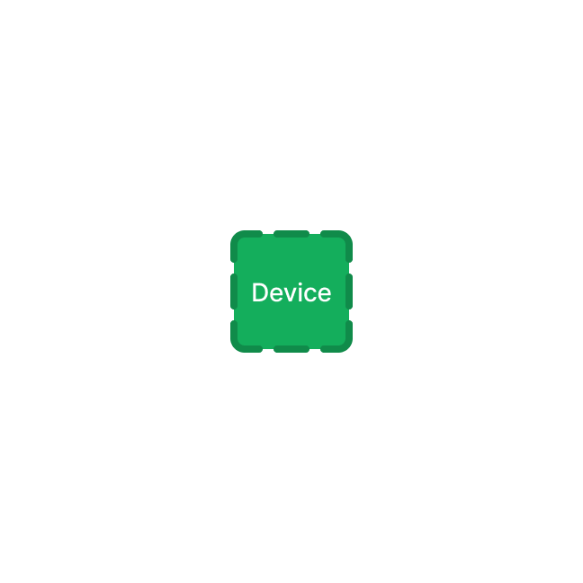
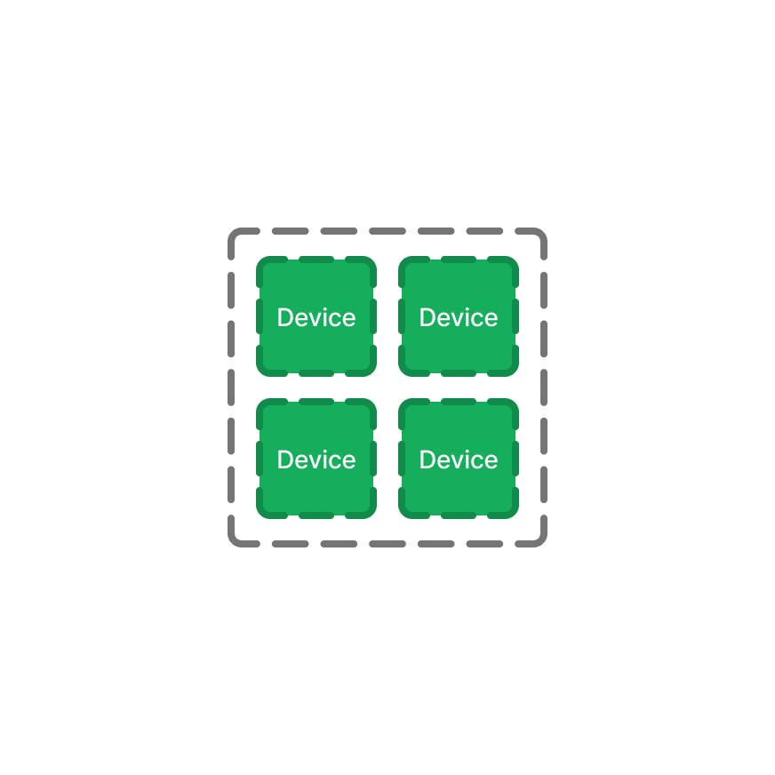
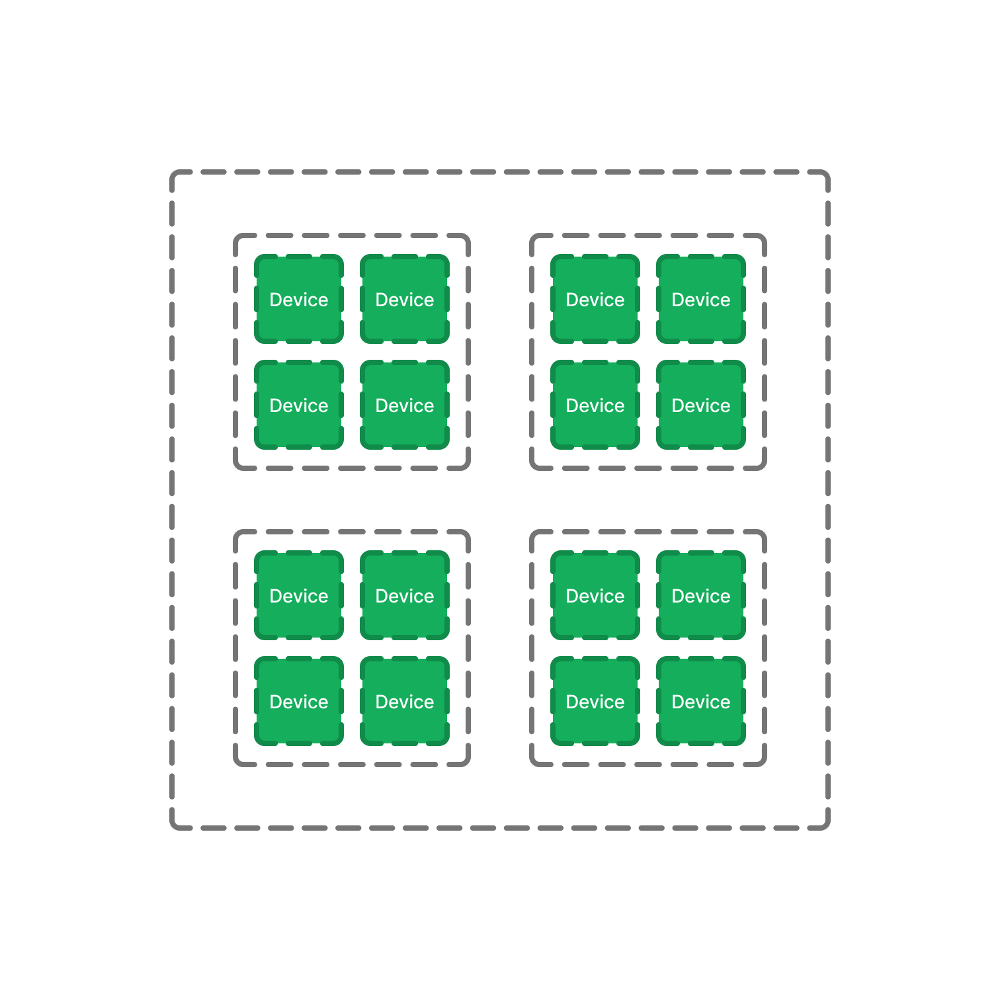

## Overview

As a developer, understanding the system is crucial when it comes to
developing on the platform. Concepts are considered best steps to get
to know the environment. We'll discuss few important concepts and deep
dive into the core logic of the network.
{/*  */}

## Device

Whether it's a microprocessor or not, clients that connect to the
service, are devices. Each device has a **State** stored in the system
which can be updated in real-time through the network.

{/*  */}

## Group

A set of devices is called a group like a building, a room, a factory,
a farm, a city, etc. Groups can hold multiple devices or sub-groups.
Let's say a person has their home in an apartment. The apartment's a
group including sub-groups and devices. Each room in a house is a
sub-group of the house containing IoT devices in it. Actually groups
are collections of devices that are somehow related to each other.


## Dashboard

A dashboard is the area where user can manage their groups and control
their devices. A dashboard is always created for each user by the
system while the signup. It refers both to the UI and the abstract
concept itself.



## Message

Communication between the system and devices is possible through
messaging, which could be over Websockets, MQTT, etc. Messages are
communication objects that are transfered over the network. At Thor,
messages follow a specific standard format:

```JSON title="JSON Message Format"
{
  "signal": "UPDATE_STATE",
  // data? update? state? command?
  "payload": {
    "power": true,
    "output": 32,
    "LED": "#0fa",
    "engine": {
      "maxTemperature": 91
    }
  },
  "id": "000000000000",
  "message": "Optional human-readable message"
}
```

```h title="Binary Message Format(Advanced)"
0xff 0x00 0xab 0xfa 0xbb 0xca 0xdd 0xfc
0xec 0x6a 0x44 0x0c 0x3a 0x68 0x16 0xf2
0x32 0xbf 0x0b 0x41 0x31 0x51 0xc4 0xe3
0x38 0x5c 0x7c 0xf0 0x94 0x09 0x58 0x4c
0xfc 0xd7 0x55 0xc5 0x6a 0xe3 0xc0 0x3f
```

```JSON title="Compressed JSON Message Format"
{
  "p": {
    "power": true,
    "output": 32,
    "LED": "#0fa",
    "engine": {
      "maxTemperature": 91
    }
  },
  "id": "000000000000"
}
```
